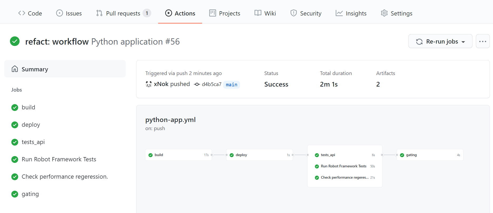
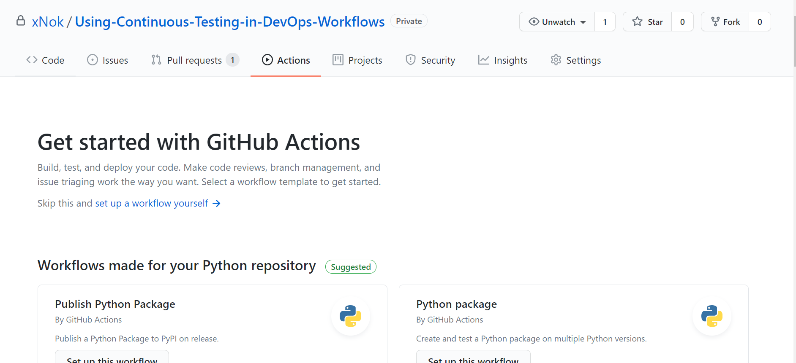
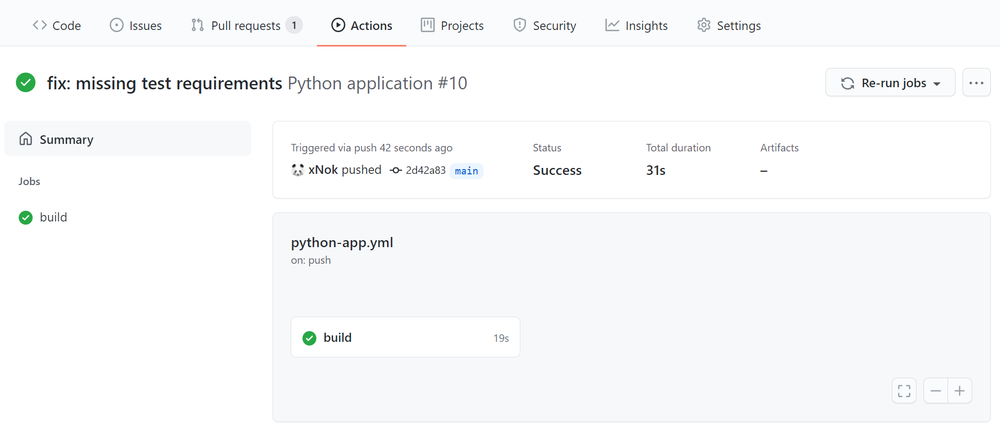
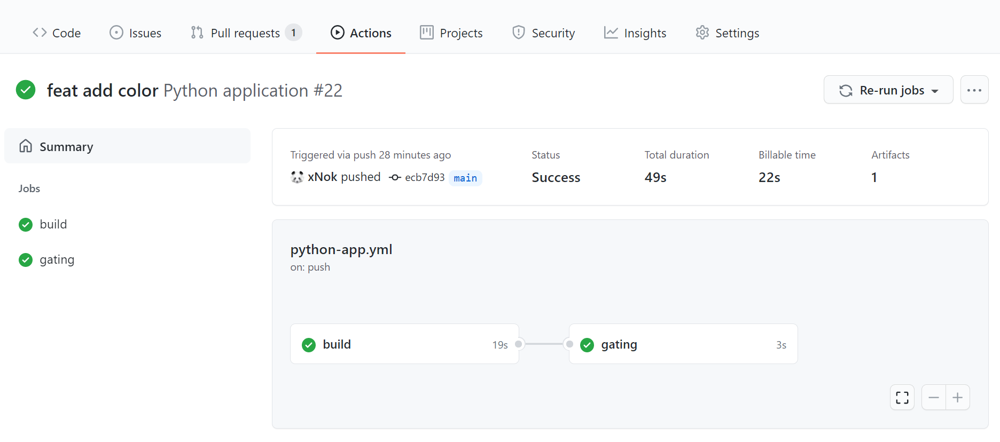
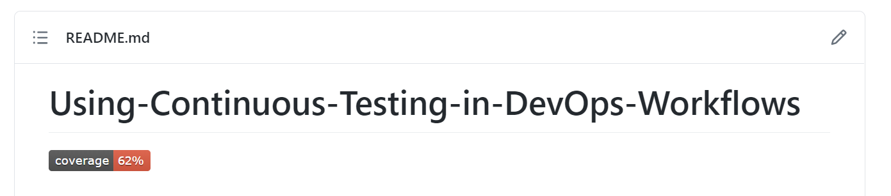
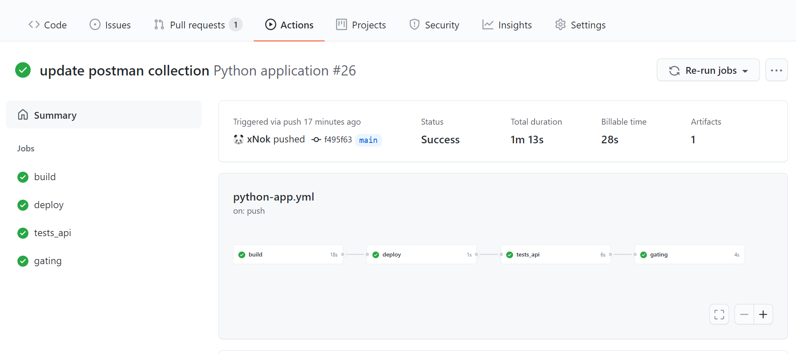
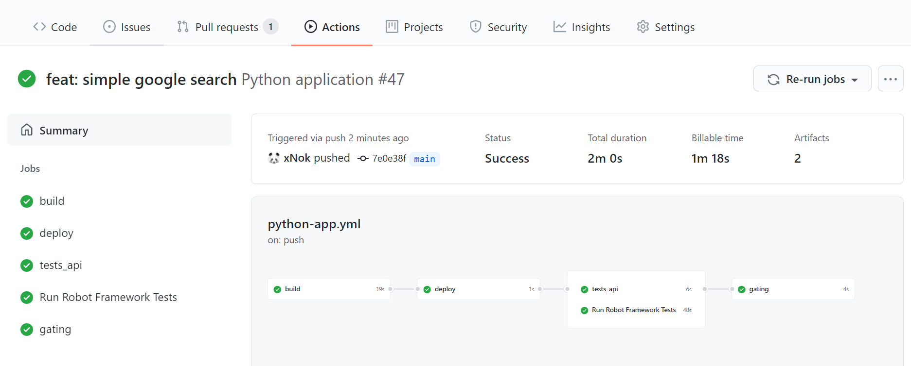

# Using-Continuous-Testing-in-DevOps-Workflows


Automation Testing is a crucial element to fasten your delivery process. The more you automate, the more confidence you gain because the quality of each release of your application or library is measurable. Additionally, you reduce cost, save time and effort by lowering manual testing. Automated testing aims to flush out any potential regressions.

The caveat is that automated tests have no value if they are not executed regularly alongside your Continuous Integration (CI) pipeline. Continuous integration refers to frequently merging developer code changes, building and creating an artifact that can later be tested and deployed. Extending the CI process by adding automated tests is referred to as Continuous Testing (CT). CT enables you to apply the fail-fast principle. Each code change, build, and deployment must be tested against several layers of automated tests. It results in rapid feedback on the quality of your product and the state of the development process.

Github Action is a great tool to implement Continuous Testing. It is flexible and powerful enough to bring every step of the CI/CT process into a single place. Your application, tests, and workflow configuration lives with your code in your repository. Furthermore, the learning curve for Github Action is relatively smooth thanks to the [Marketplace](https://github.com/marketplace?type=actions) that provide thousands of Actions ready to use out of the box.

## What does it take to implement Continious Testing?

A good CI/CT process always contains at least the following step: 
* Build and unit tests
* deployment to the dev environment
* integration
* end-to-end test
 
In this tutorial, You will implement these steps with Github Action. You will also add performance tests into your workflow. It is convenient to deploy your application in a `dev` environment before running complex tests such as integration and end-to-end. However you may also run your application in Github action for test purposes. Here is a visual of the final workflow for this tutorial:



Succeding in Implementing Continuous Testing can be challenging. It may create frustration for teams that are not used to the fail-fast approach. Seeing builds or pipelines failing can be overwhelming at the beginning. Prioritizing fixing tests instead of focusing on new features might also be a significant change. 

To remediate to those challenges you should rely on the 5 DevOps as discribed by Pillar Jez Humble in “The DevOps Handbook”:  Culture, Lean, Automate, Measure ,and Sharing.

Implementing Continuous Testing is first a change in **Culture**. Selecting the right tools for Continuous Integration and Continuous Testing can greatly improved collaboration. Github Action is a great choice with that concern in mind.

Keep your process **Lean**. Testing should not slow down your process. Instead, select the right amount of tests at the right time in the process. Thus keep an eye on your [job execution time](https://docs.github.com/en/actions/managing-workflow-runs/viewing-job-execution-time). Preferer small tasks that can fail fast and provide rapid feedback instead of long-running ones. 

**Automate** as much and as early as possible because it helps validate that the integration is successful. Delaying test implementation is counterproductive.

**Measure** your improvement and build a baseline for the quality of your software. For example, collect your code coverage, number of successful vs. failed tests, and performance metric.

Do not forget to encourage knowledge **Sharing**. Test automation is not a single man's job. Everyone in the team should know how the test suites work and fix simple errors when the workflows fail.

## Implementing CI/CT with GitHub Actions

Now that you know the basics of Continious Testing, it is time to see how to implement the first step in the process by creating a Github Actions Workflow that build and run our unit tests.

### Build a GitHub Actions pipeline with unit tests

The first thing you need is an initial workflow. If you already committed your application to a Github Repository, click on `Actions`. Github will automatically select and recommend a simple workflow that best suits your language. Select one of them by clicking on `Set up this workflow`, review the workflow steps, and commit. Right away, you should see your workflow starting to build and testing your application. Many starting workflows also include linting that validates the formating and detects potential errors.



A Github Action Workflow is made up of three elements:

* **Triggers** (`on`), they specify when the workflow must be executed. The most common use case is to run workflow on push and pull-request on the `main` branch. [See the documentation](https://docs.github.com/en/actions/reference/workflow-syntax-for-github-actions#on)

* **Jobs**, they determine sets actions of your pipeline and are executed in parallel unless dependencies between jobs are specified.

* **Steps**, they are the individual components of a Job and can be of two types `Scripts` or `Actions`. Steps defining a `run` attribute execute a command on the host defined by  `runs-on` at the beginning of a Job. Steps containing `uses` execute an [Action](https://docs.github.com/en/actions/creating-actions), a reusable automation script.

It’s straightforward to extend a workflow once you understand those three concepts. Here’s a sample workflow, that was recommended to me for a Python application :

```yaml
name: Python application

on:
  pull_request:
    branches: [ main ]

jobs:
  build:

    runs-on: ubuntu-latest

    steps:
    - uses: actions/checkout@v2
    - name: Set up Python 3.9
      uses: actions/setup-python@v2
      with:
        python-version: 3.9
    - name: Install dependencies
      run: |
        python -m pip install --upgrade pip
        pip install flake8 pytest
        if [ -f requirements.txt ]; then pip install -r requirements.txt; fi
    - name: Lint with flake8
      run: |
        # stop the build if there are Python syntax errors or undefined names
        flake8 . --count --select=E9,F63,F7,F82 --show-source --statistics
        # exit-zero treats all errors as warnings. The GitHub editor is 127 chars wide
        flake8 . --count --exit-zero --max-complexity=10 --max-line-length=127 --statistics
    - name: Test with pytest
      run: |
        pytest
```

This what a basic workflow looks like:




### Add code coverage reports

With Github, most users rely on third parties to get coverage reports (such as [SonarQube](https://www.sonarqube.org/) or [Codecov](https://about.codecov.io/)). Integrating those SaaS into your workflow is simple, thanks to the Github action marketplace. Most third parties providing code coverage reports have created an Action to make the integration seamless.

Yet, let's not rely on a third party yet. Instead, you want to be able to generate a badge to display in our `Readme.md`. You are putting in olace the very first step toward tracking code quality.

* Edit your existing `Test with xxx` step to generage a coverage report.
* Save the coverage report as an artifact. [Storing workflow data as artifacts](https://docs.github.com/en/actions/guides/storing-workflow-data-as-artifacts).
* Create a new Job `gating` and download the coverage report. This job must be executed after `build` therefore you must declare `needs: build` in you configuration.
* Parse the coverage report to extract the coverage value. I provided a small script that does just that.
* Renerate the badge and add it to you readme. Follow the setup step in the documentation of [schneegans/dynamic-badges-action@v1.1.0](https://github.com/Schneegans/dynamic-badges-action).

```
# This workflow will install Python dependencies, run tests and lint with a single version of Python
# For more information see: https://help.github.com/actions/language-and-framework-guides/using-python-with-github-actions

name: Python application

on:
  push:
    branches: [ main ]
  pull_request:
    branches: [ main ]

jobs:
  build:
    runs-on: ubuntu-latest
    steps:
    - uses: actions/checkout@v2
    - name: Set up Python 3.9
      uses: actions/setup-python@v2
      with:
        python-version: 3.9
    - name: Install dependencies
      [...]
    - name: Lint with flake8
      [...]
    - name: Test with pytest
      # Update the command to generate coverage repot
      run: pytest --cov-report xml --cov=phonebook tests/
    - name: Upload pytest test coverage
      # Upload the coverage result as an artifact
      uses: actions/upload-artifact@v2
      with:
        name: coverage-results
        path: coverage.xml
      # Use always() to always run this step to publish test results when there are test failures
      if: ${{ always() }}

  gating:
    runs-on: ubuntu-latest
    needs: build

    steps:
    - name: Download coverage report
      uses: actions/download-artifact@v2
      with:
        name: coverage-results
    - name: Get the Coverage
      shell: bash
      run: |
        regex='<coverage.+line-rate="([0-9).[0-9]+)".+>'
        line=$(grep -oP $regex coverage.xml)
        [[ $line =~ $regex ]]
        coverage=$( bc <<< ${BASH_REMATCH[1]}*100 )
        if (( $(echo "$coverage > 80" |bc -l) )); then
          COLOR=green
        else
          COLOR=red
        fi
        echo "COVERAGE=${coverage%.*}%" >> $GITHUB_ENV
        echo "COLOR=$COLOR" >> $GITHUB_ENV
    - name: Create the Badge
      # save the badge configuration in a Gist
      uses: schneegans/dynamic-badges-action@v1.1.0
      with:
        auth: ${{ secrets.GIST_SECRET }}
        gistID: ab3bde9504060bd1feb361555e79f51d
        filename: coverage.json
        label: coverage
        message: ${{ env.COVERAGE }}
        color: ${{ env.COLOR }}
```

This is what your updated workflow looks like:



And you got a badge to decorate your `readme.md`.



## Extending CT with other types of testing

You have a basic Continious Integration workflow that includes unit test and coverage report. Now to obtain good Continious Testing workflow you need to extand with more layers of test. You will add three new Jobs: one for API Testing, one for End-to-End Testing and one for End-to-End Testing

### Add API Testing

API testing is part of Integration Testing. Integration Testing aims to determine if individual units meet your requirement when combined together. When performing Integration Testing, you target the boundary (or interfaces) or your system. In this specific case, you are aiming your test at a Restfull API interface. Having API tests ensure that sets functionality meets your requirement and validates that your web server and connection to a database works properly.

While you could write an API test in the same language as your application, you should also consider a tool like [Postman/Newman](https://blog.scottlogic.com/2020/02/04/GraduateGuideToAPITesting.html). Postman lets you define a sequence of HTTPS calls and validate each of them using their JavaScript test framework. Using Postman makes it easy to share integration test suites. Other developers can use them to facilitate their development process, for instance, mobile developers that might be working with a totally different stack than back-end developers.

Newman is the command-line interface that lets you run the Postman tests. Now that you have selected an API testing framework, go to Github [Action Market place](https://github.com/marketplace?type=actions) and look for an action that meets your demands. For instance this one: [Newman Action](https://github.com/marketplace/actions/newman-action)

Now edit your workflow configuration.:
* Add a new job that must be executed after the deployment using `needs: deploy`.
* Define the steps of your job: 
    * checkout your repository using the Action actions/checkout@master
    * Run Newman using the action you just found in the marketplace
* Move the gating job at the end of the workflow by changing the `needs` proprety.

```yaml
name: Python application

on:
  push:
    branches: [ main ]

jobs:
  build:
    [...]
  deploy:
    [...] # our deployment steps
  tests_api:
    needs: deploy
    runs-on: ubuntu-latest
    steps:
    - uses: actions/checkout@master
    - uses: matt-ball/newman-action@master
      with:
        collection: tests_integration/postman_collection.json
        environment: tests_integration/postman_environment.json
  gating:
    needs: tests_api
    [...] # we move the gating at the end of the workflow
```

Now you workflow should contain 4 sequential jobs:



### Add End-to-End Testing

End-to-End Testing (e2e) aims to test a complete use case from the user perspective. You should see e2e as replacing a human with a robot. When it comes to select an e2e framework, I recommend prioritizing a that supports the Gherkin language. Gherkin is a way of writing tests in natural language (aka. plain English). The advantage of this approach is that more people can understand the test case, including Product Owners and Business Analysts. As a result, you create a better collaboration in the team. Verbalizing tests ensure that you are writing them from the User's perspective and not making the mistake of testing the function you just coded. 

I selected RobotFramework for this example. RobotFramework uses Selenium to control a web browser and thus replace a human by simulating clicks and text entries. Once again, you can go to [Gitbhub Action Market place](https://github.com/marketplace?type=actions) and look for an action meeting your needs. For instance, this one: [Robot Framework Docker Action](https://github.com/marketplace/actions/robot-framework)

Add a new job to the workflow configuration. This job must be executed after deploy using`needs: deploy`. You will notice that since `tests_api` and `test_e2e` both needs `deploy`, they will be executed in parallel after the deployment. For this example, you’ll have a workflow like this:

```yaml
name: Python application

on:
  push:
    branches: [ main ]

jobs:
  build: [...]
  deploy: [...]
  tests_api: [...]
  test_e2e:
    runs-on: ubuntu-latest
    needs: deploy
    name: Run Robot Framework Tests
    steps:
      - name: Checkout
        uses: actions/checkout@v2
      - name: Create folder for reports
        run: mkdir reports
      - name: Robot Framework Test
        # NOTE: joonvena/robotframework-docker-action@v0.1 had permissions issue
        # This action is base on a docker image. I had to fall back to that image
        # and use --user flag
        run: |
          docker run \
            -v ${PWD}/reports:/opt/robotframework/reports:Z \
            -v ${{ github.workspace }}/tests_e2e:/opt/robotframework/tests:Z \
            --user $(id -u):$(id -g) \
            -e BROWSER=chrome \
            ppodgorsek/robot-framework:latest
      - name: Upload test results
        uses: actions/upload-artifact@v1
        if: always()
        with:
          name: robotframework report
          path: reports
  gating:
    needs: [tests_api, test_e2e]
    [...] # we move the gating at the end of the workflow
```

Your updated workflow must look like this:



### Add Performance Testing 

Performance Testing is a broad topic because there is not one  but multiple types of performance testing. Most of the sources on the internet agree on six types: Load testing, Stress testing, Soak testing, Spike testing, Scalability testing, Capacity testing. Yet, I do not recommend that you try to put in place each of them. Instead, you need to consider that there are two approaches to performance testing. 

The first approach is to identify the bottleneck; for that, you will design an experiment that identifies those bottlenecks and measures the limit of your system. 

The other approach is benchmarking; when performing benchmarking, you first identify critical elements of your application and measure over time its speed. The goal of benchmarking is to improve that metric over time; conversely, if the metric degradation you want your Continuous Testing to alert you of regression in performance and address the problem as soon as possible.

Similar to the previous types of test, you will create a new job called `test_performance`. This time I did not find an Action on the marketplace that fits my requirement. But I recommend [this article](https://medium.com/nerd-for-tech/ci-build-performance-testing-with-github-action-e6b227097c83) to help you select your framework and implement the steps of this job yourself. Here is the workflow I came up with for my python application:

```yml
name: Python application

on:
  push:
    branches: [ main ]

jobs:
  build: [...]
  deploy: [...]
  tests_api: [...]
  test_e2e: [...]
  tests_performances:
    name: Check performance regeression.
    runs-on: ubuntu-latest
    needs: deploy
    steps:
      - uses: actions/checkout@v2
      - name: Set up Python 3.9
        uses: actions/setup-python@v2
        with:
          python-version: 3.9
      - name: Install dependencies
        run: |
          python -m pip install --upgrade pip
          pip install flake8 pytest
          if [ -f requirements.txt ]; then pip install -r requirements.txt; fi
          if [ -f test-requirements.txt ]; then pip install -r test-requirements.txt; fi
      - name: Run benchmark
        run: pytest tests_performances --benchmark-json output.json
      - name: Store benchmark result
        uses: rhysd/github-action-benchmark@v1
        # NOTE: this action only works for public repository
        # A pull-request is open with a fix
        with:
          tool: 'pytest'
          output-file-path: output.json
          # Personal access token to deploy GitHub Pages branch
          github-token: ${{ secrets.PERSONAL_GITHUB_TOKEN }}
          # Push and deploy GitHub pages branch automatically
          auto-push: true
          # Show alert with commit comment on detecting possible performance regression
          alert-threshold: '200%'
          comment-on-alert: true
          fail-on-alert: true
          alert-comment-cc-users: '@xNok'
```

Your final workflow must look like this:


## Conclusion

Github Action is a fantastic tool for implementing Continuous Integration and continuous testing pipelines. Thanks to the contribution of the community to the marketplace that offers all you need to get started. In my experience, no other CI/CT tools let me create a workflow that easily. It feels effortless to have a complex pipeline with many jobs.

There are three essential stages in a continuous testing workflow. Each of them tests your system from a different perspective. Unit tests validate the internal logic. Integration tests validate the response of the system from its boundary. End-to-end tests validate the system from the user's perspective.

Finally, to succeed in implementing continuous testing, you need to focus on your culture. Testing should become part of your DNA, and the five pillars to remember are Culture, Lean, Automation, Measurement, and Sharing.

## References

https://faun.pub/robot-framework-testing-using-github-actions-e0aa8df16fd8
https://itnext.io/github-actions-code-coverage-without-third-parties-f1299747064d
https://docs.github.com/en/actions/guides/building-and-testing-python
https://docs.github.com/en/actions/guides/storing-workflow-data-as-artifacts
https://docs.github.com/en/actions/learn-github-actions
https://medium.com/nerd-for-tech/ci-build-performance-testing-with-github-action-e6b227097c83
https://www.cigniti.com/blog/types-of-performance-testing/
https://searchsoftwarequality.techtarget.com/definition/performance-testing

